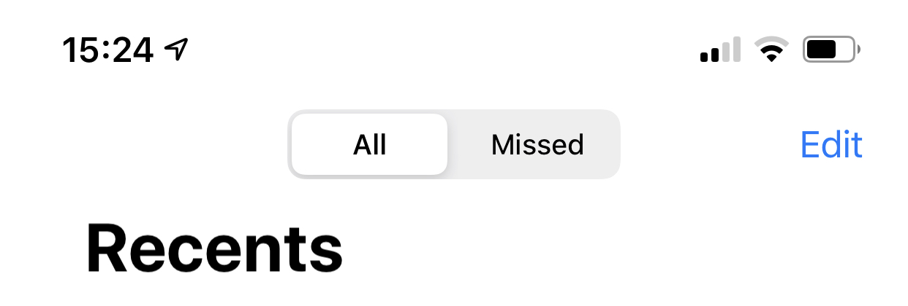

# NavigationTitleView

Package to enable `titleView` or `ToolbarItemPlacement.principal` with a navigation bar title in SwiftUI

## Problem

In SwiftUI there is the convenient `toolbar` and `toolbarItem` APIs that allow
the developer to add content to toolbars and navigation bars easily and to 
define the semantics of where that content should appear within the bar.
Additionally, SwiftUI makes it extremely easy to change the navigation title
display mode with `navigationBarTitleDisplayMode`. However, there is at least
one conflict between the display mode and toolbar item API: with a `large` or
`automatic` display mode any content put in the `principal` placement will not
be displayed at all.

The use case is something like the "Recents" tab in the Phone.app UI.


## Solution

Use `UIViewConrollerRepresentable` to hook directly into the underlying UIKit 
objects and insert the desired text into the view controller and its attendant
`navigationItem`. This works really well but does rely on a bit of internal
book keeping and the assumption that once any part of a navigation stack uses
this system, *all* of that stack uses this system. In practices this isn't so
bad because the only exposed methods are extensions on `View` that are
extremely similar to existing functionality.

## Usage

### Another Swift package
Add to your `Package.swift` file
```
let package = Package(
  ...
  dependencies = [
    .package(url: "https://github.com/amonshiz/NavigationTitleView.git", Package.Dependency.Requirement.branch("main")),
    ...
  ],
  targets = [
    .target(
      name: "YourTarget",
      dependencies: ["NavigationTitleView", …],
      ...),
    ...
  ]
)
```

### Add to an app
- File -> Swift Packages -> Add Package Dependency ...
- `https://github.com/amonshiz/NavigationTitleView.git`
- Track the `main` branch (I make no promises on keeping tags up to date)

### In the code
```swift
import SwiftUI
import NavigationTitleView

struct ContentView: View {
  @Namespace var aNamespace // required

  var body: some View {
    NavigationView {
      // Does not need to be a list, but this is does demonstrate the `.large`
      // style title behaviors best
      List {
        Text("Hello, world").padding()
          // Used in the same place the usual `.navigationTitle(_)` or
          // `.navigationBarTitle(_)` would be used
          .navigationTitle("A Great Title", within: aNamespace)
      }
    }
    // Should be used *on* the navigation stack to track
    .rootNavigationBarIdentified(within: aNamespace)
  }
}
```

## Issues
- Requires that any given navigation stack with in a `NavigationView` that wants to use this feature uses it for every title
- Does not work with AppKit or watchOS yet
- There is a bug in SwiftUI that causes an `[Assert]` to fire after pushing two views onto a navigation stack ([feedback documented here](https://github.com/amonshiz/feedback-examples/blob/main/README.md#displaymodebuttonissue)) so just know that isn't caused by this!
